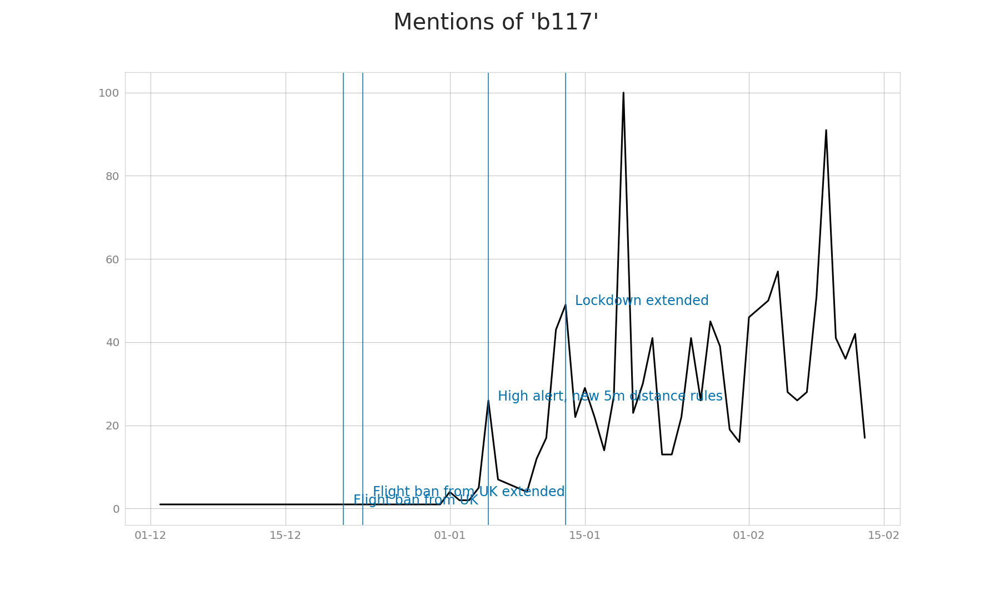
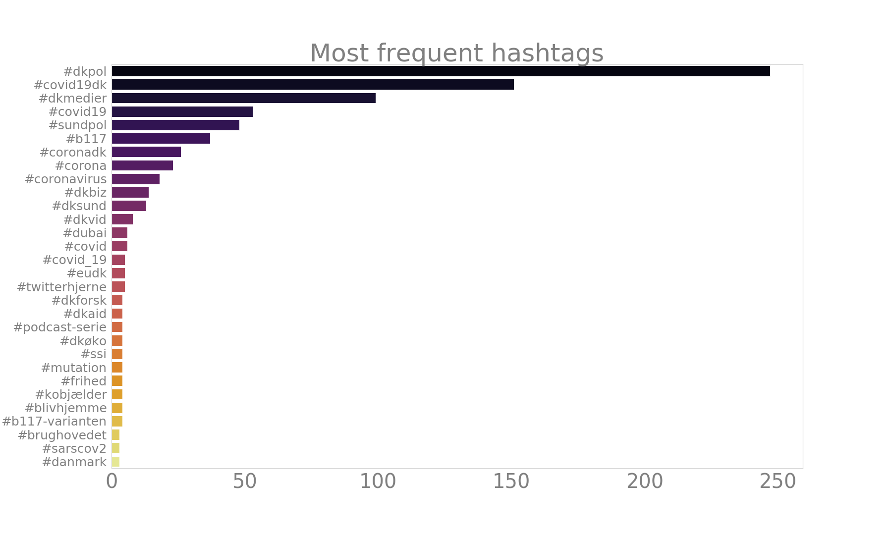
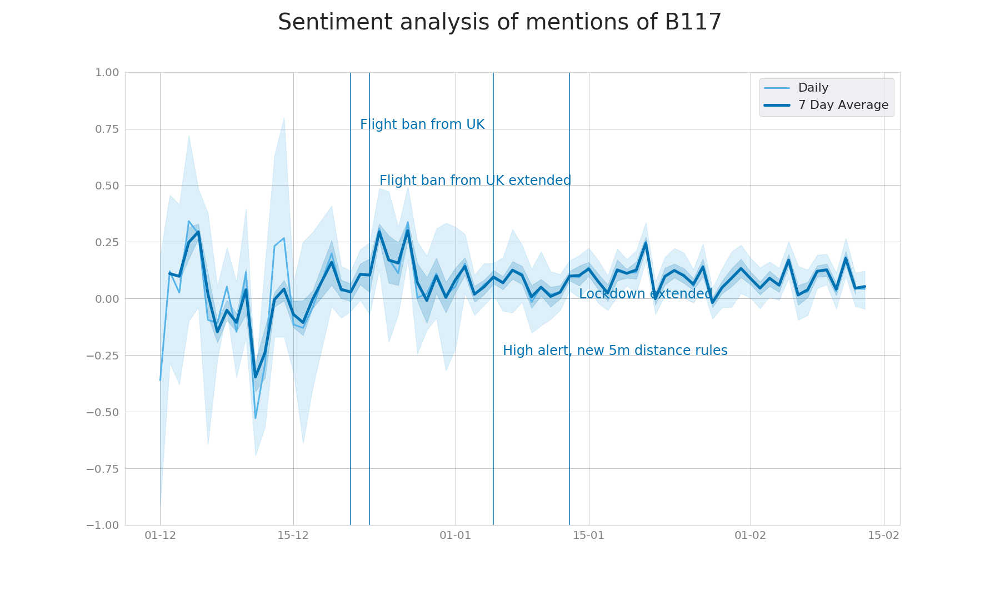
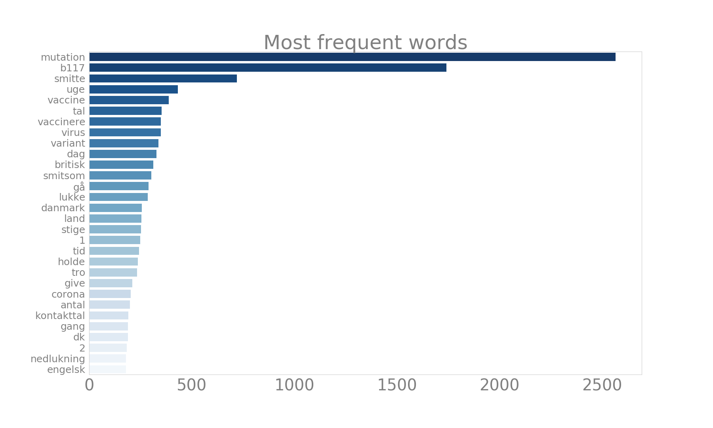
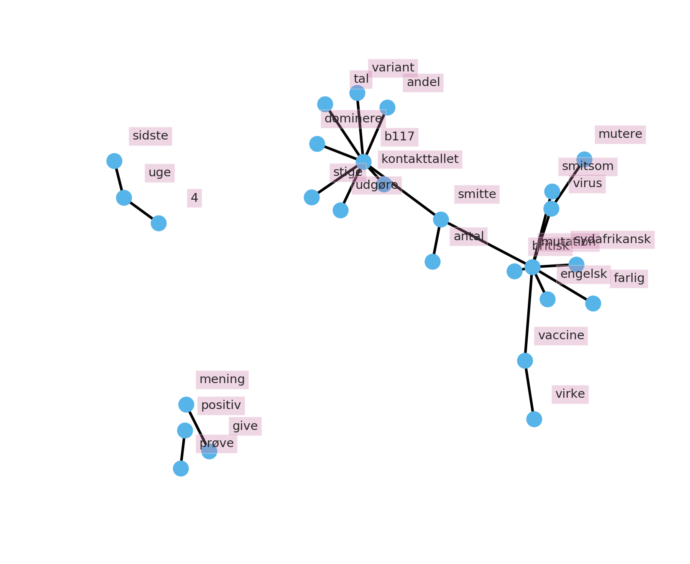

# HOPE: Mentions of new variants of Covid19 in the Danish Twitter
This repository contains an overview of the discourse on the Danish Twitter in relation to the English mutation B117.

Data was collected with two methods:
1. Narrow search, looking for the following keywords:
- 'b117', 'b.1.1.7', 'b1.1.7',
- 'britisk corona', 'britiske corona',
- 'britiske virus', 'britisk virus',
- 'engelsk mutation', 'engelsk variant', 'engelsk corona', 
- 'super-covid', 'super covid', 'boris-mutationen'
2. Wider search, looking for the following:
- 'britsik', "britiske'
- 'mutant', 'mutated', 'mutation'
- 'engelsk', 
- 'england'
- 'mink' (included to be able to separate mink-related mutation) 

The search checks for which keywords and keyword combinations are mentioned in a tweet. This way it’s possible to check for tweets that don’t contain “b117” but from a combination of “engelsk” and “mutation” we can infer that the tweet is likely about the B117 variant. The search was not specific for just gathering relevant hashtags since it’s not known which hashtags are trending in this discourse.

While analyzing the tweets, another keyword popped up - the mink variant is also referred to as "cluster 5", so all tweets that contained "cluster 5" or "cluster5" were further removed from the dataset. Overall, there are **1781** matching tweets, with an average of **79.8** tweets per day.

## Date range
1.12.2020 until 22.01.2021

## Preprocessing
Retweets were discarded, and quote tweets were removed. The way of removal was via checking whether the 50 first characters overlapped between the tweets in the dataset (user mentions in the beginning of tweets were ignored). This resulted in the removal of 643 duplicates.

Checking tweets that just match “mutation” shows that most often the talk is around the Covid strand, so those tweets were kept. Combination of keywords which included “mink” were removed, also tweets where the only keyword matched was something generic like “England” were removed.

Interestingly, there were tweets which both had the mink keyword and keywords related to B117. Since there were less than 100 tweets of the overlap, they were excluded from the analysis.

## Time series analysis

The above figure shows the total mentions of B117 mutation of Covid over time. The straight line shows there is an upwards trend around the discourse about the B117 mutation.

The above figure shows the mentions of the keyword “b117”, which started being used just before 1st January. Interestingly, “b117” was not used when the flight ban from the UK began, and was instead referenced to with other keywords.

## December discourse vs January discourse
For December, there are 482 tweets, and 1319 tweets for January. On average, 42 tweets per day in December (median 25), and 94 in January (median 83).

| Keywords        | December | January |
|-----            |--------|----|
| b117            | 12     | 434 |
| britisk corona  | 5      | 8 |
| britisk virus   | 2      | - |
| britiske corona | 2      | 4 |
| britiske virus  | 1      | - |
| engelsk corona  | 5      | - |
| engelsk mutation| 1      | 13 |
| b117, britiske virus |   - | 1 |

The keyword combinations overview comparison between December and January data shows that B117 has much more mentions in the January dataset, the mentions grow from 12 to 435 mentions. “Engelsk mutation” also grows in mentions over time.

This data could indicate that in December the discourse varies more in terms of which keywords are used to tweet about the new mutation, and by January the keyword usage is more distilled.

| Keywords                      | December | January |
|-------------------------------|--------|----|
| *engelsk, mutation, england*  | 1      | 2 |
| *engelsk, mutation, britiske* | -      | 1 |
| *engelsk, mutation*           | 19     | 73 |
| mutant, britiske              | 1      | 4 |
| mutant, england               | 1      | - |
| mutant, engelsk               | -      | 7 |
| mutant, mutation              | -      | 3 |
| mutant                        | 33     | 52 |
| mutation, britiske            | 8      | 86 |
| mutation, england, britiske   | -      | 1 |
| mutation, england             | 20     | 13 |
| mutation                      | 382    | 677 |

“Engelsk, mutation” is a keyword combo that overlaps with the keyword “engelsk mutation” in the narrow search.

## Frequent hashtags
A hashtag analysis was conducted to see if there might be a trending hashtag popping up in the dataset.

The above figure shows the mentions of the keyword “b117”, which started being used just before 1st January. Interestingly, “b117” was not used when the flight ban from the UK began, and was instead referenced to with other keywords.

These are the 30 most popular hashtags used in the dataset. The most popular hashtags are popular hashtags related to Covid-19 - #dkpol, #covid19dk, #dkmedier, #covid19, #sundpol. The hashtag #b117 shows up but with low counts. There is no reliable trending hashtag in relation to B117 discourse.

## Sentiment analysis
The compound semantic scores were calculated with the Danish Vader. Overall the sentiment differs a lot in December and less towards January. In January, the sentiment is more positive but the scores generally remain within the neutral range. There is not enough data to conclude anything more meaningful than that the semantic scores vary.

The high variance in December compared to January is probably at least partially explained by there being much more data in January.

## Word frequency
For the following analysis, all tweets were tokenized and lemmatized, to make sure that different forms of “mutation” would be considered as its stem form. Stop words were removed.

The word frequency plot shows that after removing stop words, it’s clear that the data centers around mutations of Covid. Much of the discourse is around the British mutation and the discourse is also related to vaccines.

The word cloud below exacerbates visually the effect of mutation and b117 being the central talking points in this dataset.

## Bigram network analysis
A network-bigram analysis was conducted on the data to investigate which words co-occur. This enables the visualization of bi- and trigrams which the previous word frequency analysis neglects.

The figure shows clusters such as "grænse" and "lukke" for the closed borders, a close relation between "covid19dk", "dkpol", and "dkmedier" - the most popular Covid-19 related hashtags.
The word "mutation" co-occurs with "smitsom", "britisk", "smitte", "sprede", "pga", "sydafrikansk", "corona". And "b117" is closely related to and "variant".
